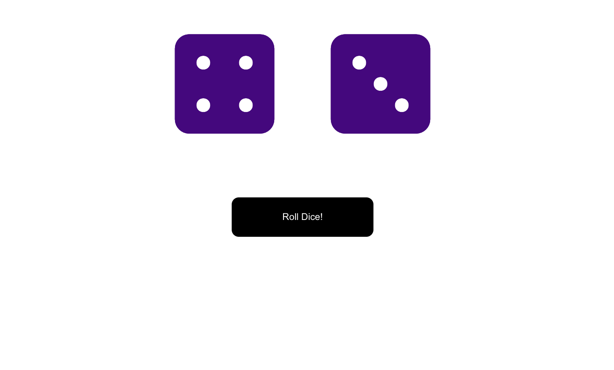

# Dice Roll

This project was done as a code-along with Colt Steele's Udemy course [The Modern React Bootcamp](https://www.udemy.com/course/modern-react-bootcamp/) as practice for learning React state. It rolls two dice on a button click and includes a shaking animation for the dice. The icons used for the dice come from [Font Awesome](https://fontawesome.com/).

## Future Development

The app does a simple task and does it well, but there could still be improvements. I'd like to add sound effects and a more realistic animation to the dice. Users could also choose how many dice they want to roll.

## Run the App

`npm start`

Runs the app in the development mode.\
Open [http://localhost:3000](http://localhost:3000) to view it in your browser.